# Clef-Flash, local

A self-contained local stack for [Cloudflare/clef-flash](https://huggingface.co/Cloudflare/clef-flash):
a GPU API container and a Gradio showcase container.

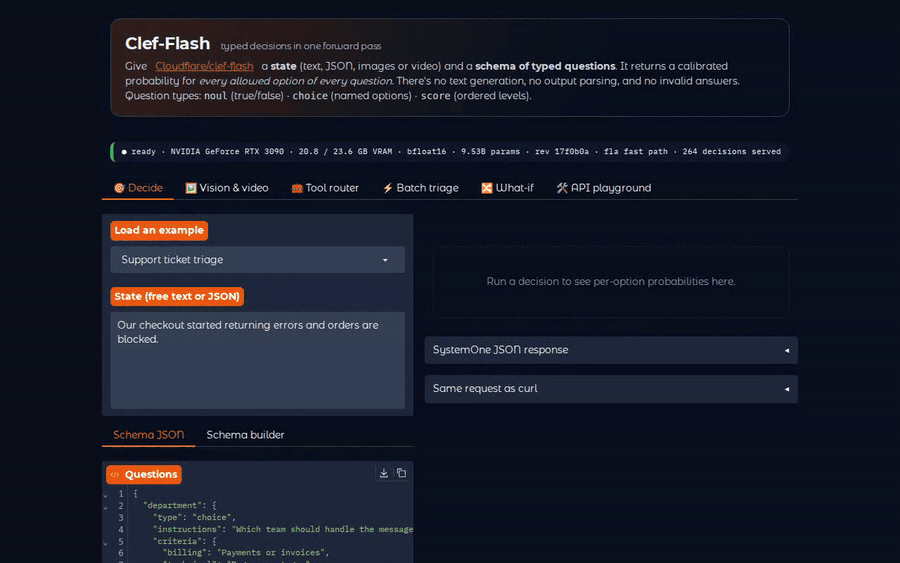

▶ **[Watch the full 50-second walkthrough (MP4)](docs/media/walkthrough.mp4)**, recorded against
the running stack on an RTX 3090. Every number in it is a live result.

## What the model is

Clef-Flash is a 9.5B multimodal **decision model**. It is a Qwen3.5-9B backbone (with its vision
encoder) plus a 122M-parameter "joint schema head". You give it a **state** (text, JSON, images
or video) and a **schema of typed questions**. A single forward pass returns a probability for every
allowed option of every question:

| type | answers | example |
|---|---|---|
| `noul` | P(true) | "Is a service down?" |
| `choice` | one of named options + full distribution | department ∈ {billing, technical, …} |
| `score` | expected level over ordered options + distribution | urgency ∈ [Can wait, This week, Today] |

It never generates text, so there is no output parsing and no invalid answers. That's also why this
stack uses **FastAPI + transformers, not vLLM**: the custom head scores options and is not a causal LM.

## Start / stop

```bash
make up            # docker compose up -d --build
make down          # docker compose down
make logs          # follow both containers
make test          # endpoint smoke tests (scripts/smoke_test.py)
make model-test    # answer-level correctness + latency (scripts/model_test.py)
make stats         # GPU + container usage
```

| URL | What |
|---|---|
| http://localhost:7860 | Showcase UI |
| http://localhost:8000/docs | API (OpenAPI docs) |
| http://localhost:8000/info | Device, VRAM, revision, limits, stats |

The first start of a fresh checkout takes ~40 s: 8 s to load weights, plus ~30 s while Triton
compiles kernels. The compiled kernels are cached in `./cache/triton`, so later restarts are ready
in ~9 s. The first request at a new input shape (e.g. your first 16k-token state) is also slow once
while Triton autotunes for it.

## The frontend

### 🎯 Decide

Any state plus any schema. There are 11 presets that mirror the model's benchmark strengths:
support triage, invoice JSON, ContractNLI, FinEntity, phishing, SOC alerts, agent-trace auditing,
WinoGrande, CLadder and forecasting. Below, three entity-level sentiment questions are answered
in one 131 ms pass. A table-based **schema builder** means you don't have to write JSON by hand,
and every request is shown as the equivalent `curl`.

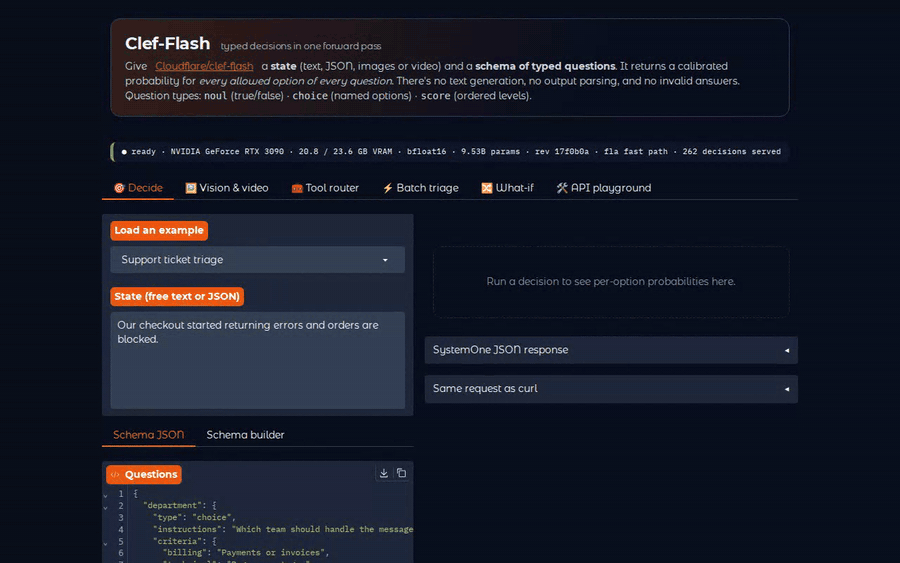

### 🖼️ Vision & video

The same typed questions, asked about an image or a video clip. The included clip cuts from a
living room to a plate of food. The model gets the opening scene (room, 96%), the closing scene
(food, 95%) and the cut itself (92.5%), so it reads the clip over time rather than one frame.

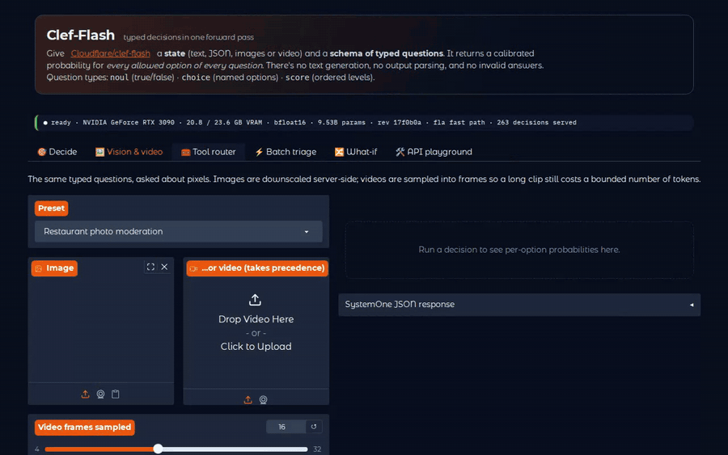

### 📹 Live webcam

Point your webcam at something and the same set of questions is asked over and over, as fast as
the GPU allows. Only one query is in flight at a time and it always takes the newest frame, so the
answers track the camera instead of falling behind. Results show three ways: live probability
bars, a timeline per question (P(true), confidence or expected level), and a log of answer changes.

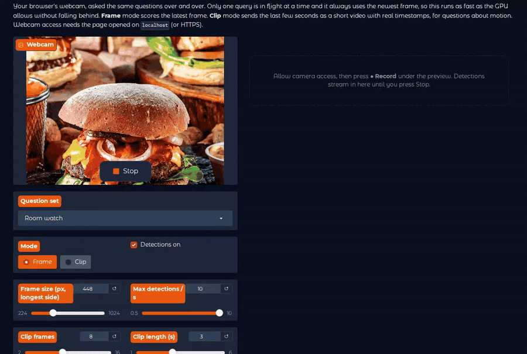

*The recording uses the repo's sample clip as a fake camera, with the questions edited live to
"room or food?". It contains no real webcam footage.*

**Using it**

1. Open the UI at **http://localhost:7860** on the machine with the camera. Browsers only allow
   webcam access on `localhost` or HTTPS, so opening it from another machine by IP blocks the camera.
2. Open the **📹 Live webcam** tab, allow camera access, and press **● Record** under the preview.
3. Pick a question set, or edit the questions JSON while it runs. Press **Stop** to end.

**Privacy.** Frames go only from your browser to the local frontend and API containers. The
frontend keeps the last ~8 seconds of frames in memory, for clip mode, and drops them when the tab
closes. Nothing is written to disk and nothing leaves the machine.

**Question sets**

GPU time per detection was measured on the RTX 3090. Detections/s follows from it, at roughly
1 / (GPU time + ~20 ms); the three marked ✓ were also measured live on a Logitech C930e.

| Set | Mode | What it answers | GPU time | ≈ Detections/s |
|---|---|---|---|---|
| Room watch | frame | person visible, how many, activity, lights on | 188 ms | 5.0 ✓ |
| At the desk | frame | present, looking at screen, phone, drinking, headphones | 183 ms | 4.9 |
| Hand gestures | frame | thumbs up/down, peace, open palm, pointing, fist; finger count | 165 ms | 5.5 ✓ |
| Hold it up to the camera | frame | phone, cup, book, paper, pen, keys…; readable text | 169 ms | 5.3 |
| Rock, paper, scissors | frame | which sign is thrown | 168 ms | 5.3 |
| Expressions | frame | smiling, neutral, frowning, surprised, tongue out; eyes closed, glasses | 170 ms | 5.3 |
| Posture check | frame | sitting upright, too close to the screen, head on hand, posture score | 189 ms | 4.8 |
| Show me a colour | frame | main colour of a held-up object (9 colours) | 173 ms | 5.2 |
| Hold up a drawing | frame | drawing shown; circle, square, triangle, star, heart, smiley, arrow, house | 173 ms | 5.2 |
| 3D printer watch | frame, 640 px | printer visible, enclosure light, part on the bed, failed print ("spaghetti"), person nearby | 271 ms | 3.4 |
| Pet watch | frame | cat, dog, other; on furniture, asleep | 167 ms | 5.3 |
| Video-call check | frame | face visible, centred, backlit, lighting score, tidy background | 189 ms | 4.8 |
| Motion | clip | waving, nodding, someone entering or leaving, amount of movement | 347 ms | 2.4–2.8 ✓ |
| Workout | clip | jumping jacks, squats, arm circles, push-ups, stretching, boxing; intensity | 349 ms | 2.7 |
| Charades | clip | drinking, phone call, typing, eating, waving, clapping, dancing, sleeping, driving | 355 ms | 2.7 |

**How the sets were checked.** Every frame-mode set was run on a real frame of an empty room. All
of them correctly found no person, no face, no gesture, no held-up object and no pet, and the 3D
printer set found the printer (0.83). The clip-mode sets were run on the sample clip (a room, then
food, no people) and correctly reported no waving, no exercise and no mime. That shows the sets
run cleanly and don't raise false alarms. Their accuracy *with* a person in frame hasn't been
measured, beyond a brief live test where Room watch tracked someone entering and leaving and
Hand gestures caught an open palm. Try them on yourself to judge.

**Controls**

| Control | Effect |
|---|---|
| Mode | **Frame** scores the newest frame. **Clip** sends the last *Clip length* seconds as *Clip frames* frames, with real timestamps, for motion questions. A clip costs about 2× a frame. |
| Detections on | Pauses querying without stopping the camera. |
| Frame size | Longest side in px (default 448, set per preset). Raise it for small things in the shot. |
| Max detections / s | Caps the rate, e.g. to leave GPU for other work. |
| Log a change after N detections in a row | Debounces the change log (default 3), so an answer near 50/50 doesn't flood it. |
| State / context | Text sent as the state alongside the image. Describing the setup helps. |
| Reset timeline | Clears the timeline and the change log. |

**Writing your own question sets**

Edit the questions JSON in the tab, or add an entry to `WEBCAM` in `frontend/presets.py`.
Lessons measured while building the sets above:

- **Give `none` a concrete description.** On an empty room, "No hand sign" let `rock` win at 40%.
  Rewording it to "No hand is held up to the camera" (and asking "which sign is held up, *if any*")
  made `none` win at 96%.
- **Make small things bigger.** A printer that fills a small part of a room-wide shot scored 0.39–0.60
  at 448 px and 0.72–0.88 at 640 px. Presets can set `"size"`.
- **Name what it looks like.** "a 3D printer *or a 3D printer enclosure*" beat "a 3D printer" at every
  frame size (0.88 vs 0.72 at 640 px).
- **Questions cost more than pixels.** Each question adds about 85–95 tokens, while 448 → 320 px
  saves only about 50. One question at 448 px runs at about 6 detections/s, and ten at about 2.7.
- **Use clip mode only for motion.** "Is someone waving?" needs time; "is someone there?" doesn't,
  and frame mode answers it about twice as fast.

**Troubleshooting**

| Symptom | Fix |
|---|---|
| No camera preview, or the browser never asks for permission | Open the UI via `http://localhost:7860`, not an IP address, and check the browser's camera permission for the site. |
| Preview works but no detections | Press **● Record**. Check that *Detections on* is ticked and the questions JSON is valid (a warning banner says so if not). |
| Detections/s lower than the table | Another app is using the GPU, the question set is larger, or *Frame size* is higher. The chips show GPU time per detection. |
| Answers flicker | The model is genuinely unsure (it's near 50/50). Raise *Log a change after N*, improve the lighting, or reword the question. |

### 🧰 Tool router

Agent routing without generating a single token. The tool list becomes a `choice` question, with
`noul` gates for "call now?" and "ask first?" and enum arguments such as room and direction. An
argument that resolves to `unspecified` is flagged as something to ask the user about. The clip
at the top of this page is this tab.

### ⚡ Batch triage

Many items, one schema, packed into padded GPU batches. The outputs are calibrated
probabilities, so a single confidence threshold turns the model into a policy: confident items
are auto-routed and uncertain ones go to a human. CSV in and out.

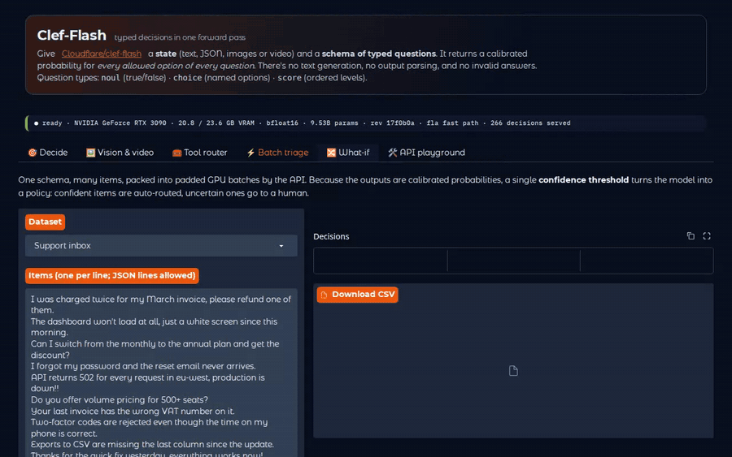

### 🔀 What-if

Two states, one schema, scored side by side in one batch, with Δ in percentage points. One word
("too large" vs "too small") flips the referent by 96 points, and the severity of a ticket moves
urgency from "Can wait" to "Right now".

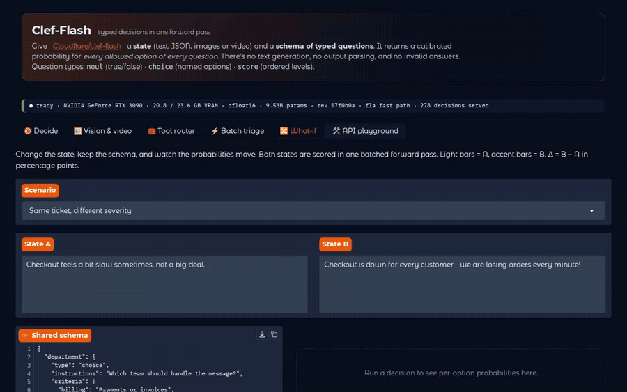

### 🛠️ API playground

Every endpoint, with an editable body, the raw response and the equivalent `curl`.

<details>
<summary><b>Full-page screenshots</b></summary>

| | |
|---|---|
| 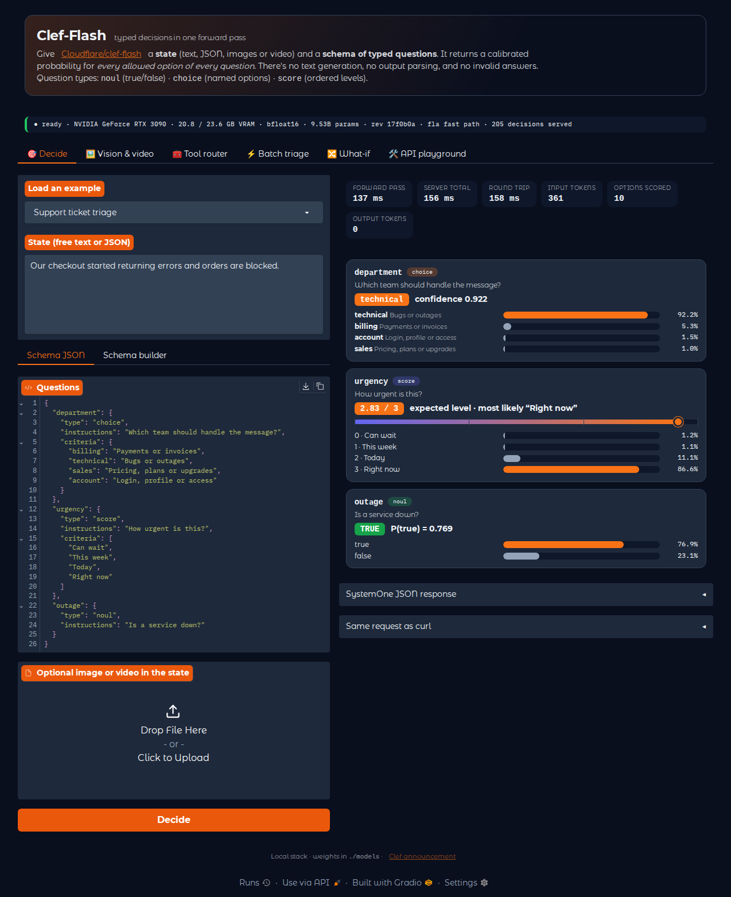 | 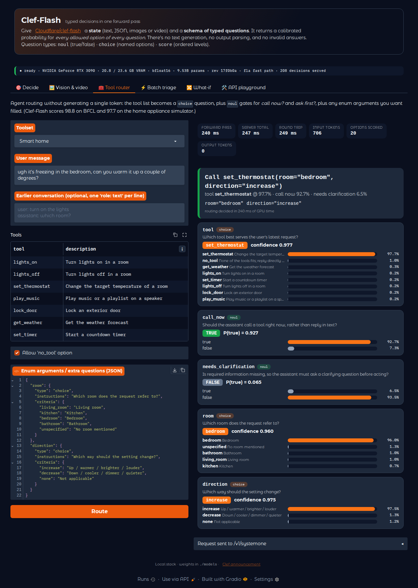 |
| **Decide**: support triage | **Tool router**: smart home |
| 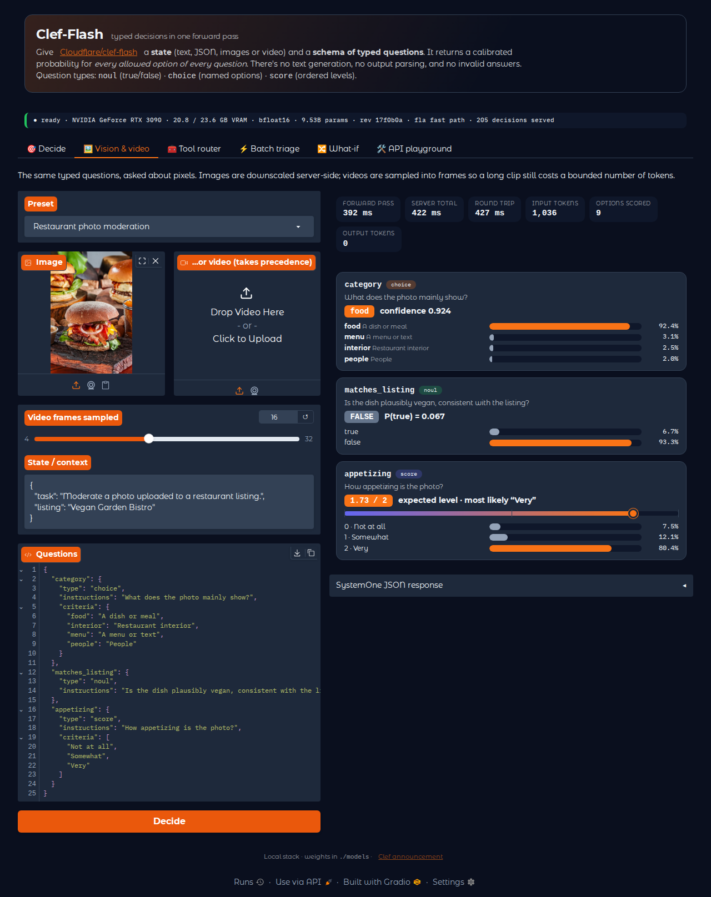 | 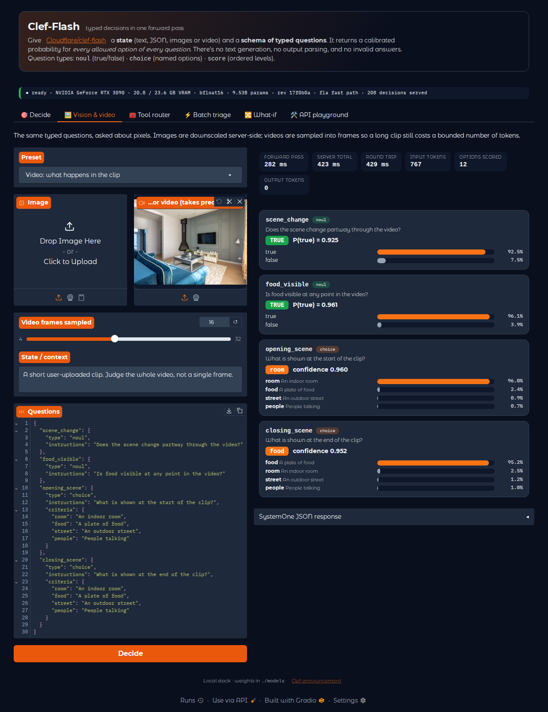 |
| **Vision**: restaurant photo moderation | **Video**: scene-cut clip |
| 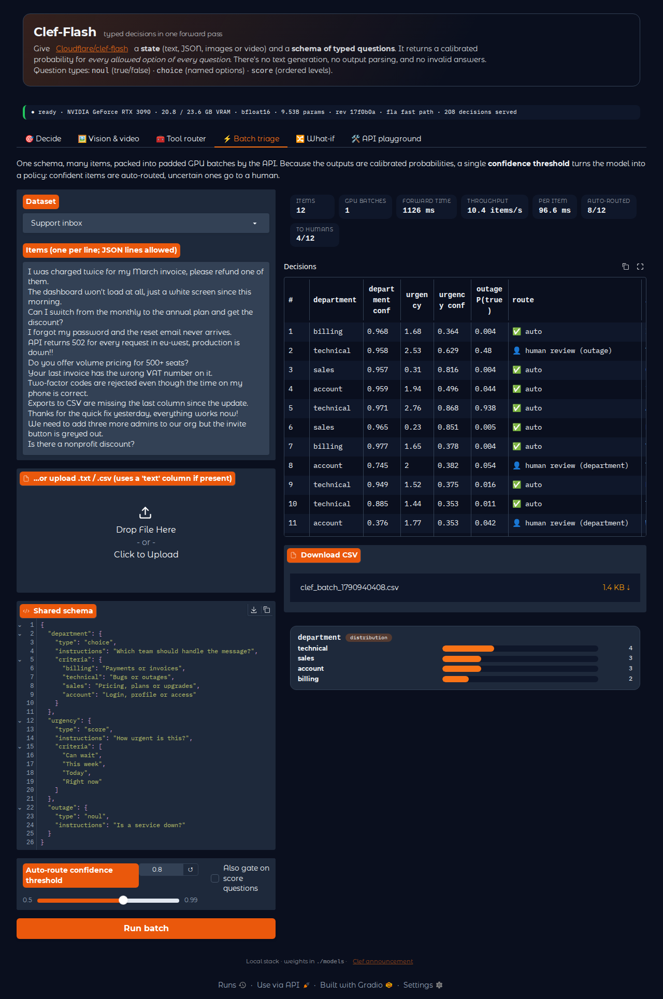 | 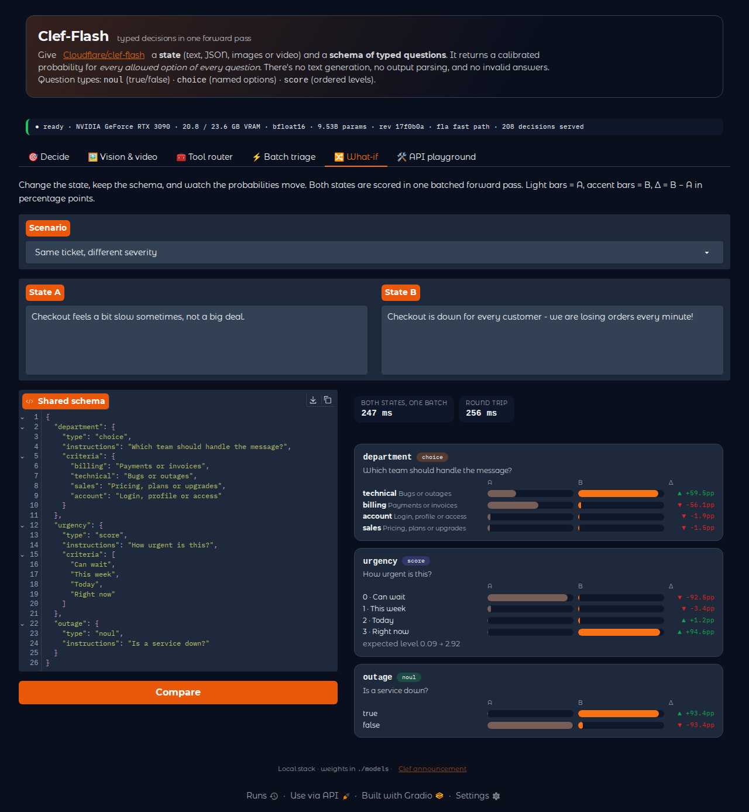 |
| **Batch triage**: support inbox | **What-if**: severity comparison |
| 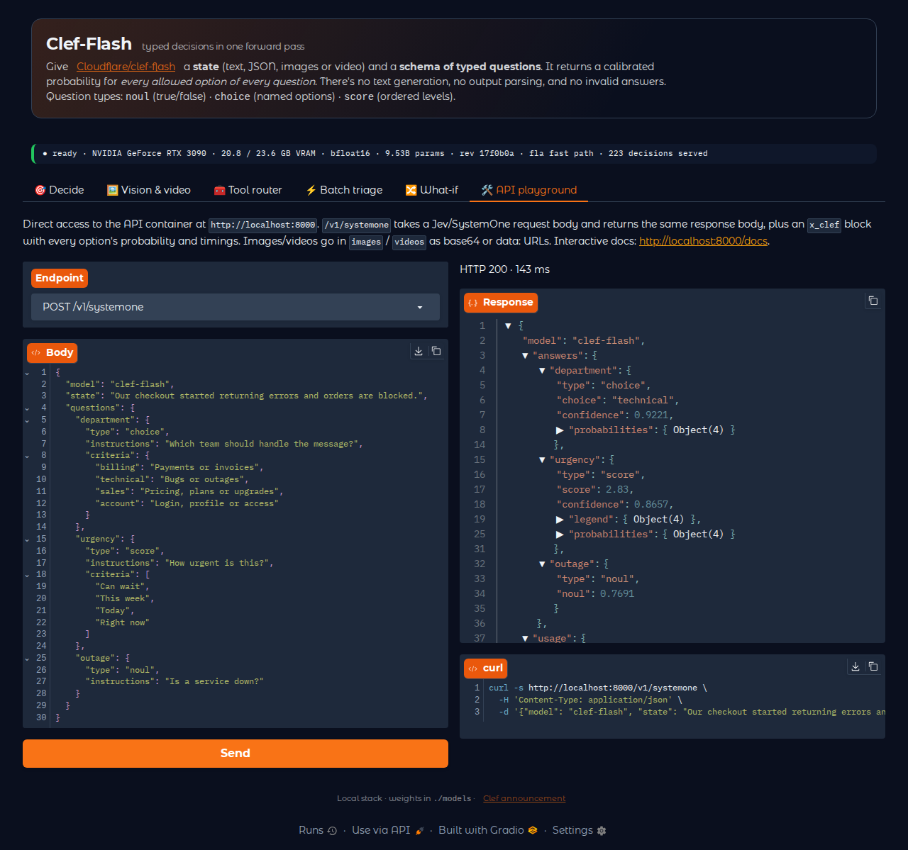 | 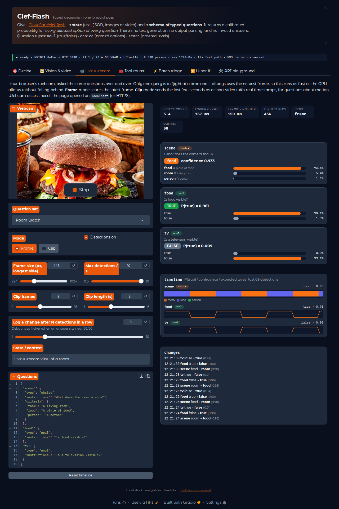 |
| **API playground** | **Live webcam**: sample clip as camera |

</details>

The media in `docs/media/` was captured with Playwright against the live stack. To regenerate it
after UI changes, see [`docs/capture/`](docs/capture/README.md).

## API

`POST /v1/systemone` is Jev/SystemOne-compatible (same request body, same response body). It adds
an `x_clef` block with every option's probability and timings, which plain SystemOne clients ignore.

```bash
curl -s localhost:8000/v1/systemone -H 'Content-Type: application/json' -d '{
  "model": "clef-flash",
  "state": "Our checkout started returning errors and orders are blocked.",
  "questions": {
    "department": {"type": "choice", "instructions": "Which team should handle the message?",
                   "criteria": {"billing": "Payments or invoices", "technical": "Bugs or outages"}},
    "urgency": {"type": "score", "criteria": ["Can wait", "This week", "Today"]},
    "outage": {"type": "noul", "instructions": "Is a service down?"}
  }
}'
```

- **Images**: `"images": ["data:image/jpeg;base64,…"]`. These are downscaled server-side to `MAX_IMAGE_SIDE`.
- **Video**: `"videos": ["data:video/mp4;base64,…"]`, or a list of base64 frames per video (e.g. a
  webcam clip) plus `"video_fps"`, the rate those frames were captured at. Optional
  `"video_frames": 16` (capped at `VIDEO_FRAME_CAP`). Frames are sampled uniformly across the clip,
  and the model gets their real timestamps.
- **Batch**: `POST /v1/systemone/batch` with `{"requests": [...]}`, or with a list-valued `state` and a
  shared `questions` object. Records are length-sorted and packed into padded GPU batches.
  Batched results match single requests to within 0.01 probability (verified by `model_test.py`).
- Errors: invalid schema → 422, GPU OOM → 413 (the server recovers), still loading → 503.

## Measured on this host (RTX 3090 24 GB, driver 595, bf16)

| | |
|---|---|
| Weights on disk | 17.8 GB in `./models/Cloudflare__clef-flash` (revision `17f0b0ad64ef`) |
| VRAM | 18.2 GB allocated at idle; 19.1 GB peak in normal use; 20.4 GB peak at 16k tokens or 8 images |
| Load | 7.5 s weights (from page cache) + 1.3 s warmup with a warm Triton cache |
| Support triage, 361 tokens | **124 ms** median forward pass, 128 ms HTTP round trip |
| Long state, 16k tokens | 3.9 s (scales linearly, ~0.25 ms/token) |
| One 1024-px image (~1k tokens) | 0.35 s forward, 0.6 s total including decode/preprocess |
| Video clip at 448 px: 4 / 8 / 16 frames | 767 / 1,063 / 1,655 tokens; 0.26 / 0.36 / 0.52 s forward |
| Live webcam (2–4 questions, 448 px) | 5.0–5.5 detections/s, see the webcam section |
| Batch, 48 support tickets | 10.6 items/s |

The model card quotes a 38.8 ms median latency on an H200. On a 3090 the forward pass is
compute-bound (~47 TFLOPS achieved). Most of each request is the schema itself, since state comes
before schema and so there is no prefix to share. For that reason batching gives a modest gain
(~25%: 4.5 s vs ~6 s sequential for 48 items) rather than a multiple.

## Memory and limits (`.env`)

The weights take 18.6 GB of 24 GB. There is no KV cache (one forward pass, `use_cache=False`), so all
remaining headroom goes to activations. The limits below were stress-tested on this card without OOM:

| Variable | Value | Meaning |
|---|---|---|
| `MAX_INPUT_TOKENS` | 16384 | Model card default; longer states are truncated (state only, never the schema) |
| `MAX_BATCH_TOKENS` | 8192 | Padded tokens per GPU batch (batch size × longest record) |
| `MAX_BATCH_SIZE` | 16 | Records per GPU batch |
| `MAX_IMAGE_SIDE` | 1024 | Longest side after downscaling (~1k vision tokens per image) |
| `VIDEO_MAX_FRAMES` / `VIDEO_MAX_SIDE` | 16 / 448 | Default frames per video, and frame size |
| `VIDEO_FRAME_CAP` | 32 | Most frames a request may ask for (32 frames ≈ 2.8k tokens, 0.94 s) |

Media records are scored one per GPU batch, so a batch of image requests can't stack vision memory.

## Weights and updates

```bash
make check     # python3 scripts/download.py --check   → has upstream changed?
make verify    # local files still match models/download.lock.json?
python3 scripts/download.py --update Cloudflare/clef-flash && docker compose restart api
```

The API imports the repo's own `joint_schema_model.py` from the weights directory. An upstream fix
to encoding or the head arrives with the download, with no code change needed here. Weights are
mounted read-only and both containers run as UID/GID 1000 (set in `.env`).

## Model-specific notes

- **Pinned stack**: torch 2.11 + transformers 5.10.2 (what the model card was tested with),
  base image `pytorch/pytorch:2.11.0-cuda12.8-cudnn9-runtime`.
- **Video frames need `do_sample_frames=False`.** Qwen3.5's video processor resamples any clip
  that arrives without timing metadata, and it reduced every clip to 4 frames whatever was sent.
  The API samples frames itself, switches the processor's sampling off and passes
  `video_metadata` (fps), so all frames reach the model with correct `<t seconds>` timestamps.
  `model_test.py` checks that 4 < 8 < 16 frames give increasing token counts.
- **`flash-linear-attention` matters.** 24 of the 32 backbone layers are Gated DeltaNet (linear
  attention), and fla supplies their Triton kernels. transformers still logs "fast path is not
  available" because the optional `causal-conv1d` package is absent. That only affects a tiny
  depthwise conv, which falls back to `F.conv1d`. `/info` → `fast_path` confirms fla is loaded.
- Option order doesn't matter for `choice` questions: the encoder sorts them. `score` options are
  ordered and indexed from 0.
- `instructions` is optional; the question id is used when it's missing. Option descriptions are
  part of what the head scores, so write them as meaningful text.
- The Space's example images (`frontend/examples/*.jpg`) are CC0. `scene_cut.mp4` was generated
  from them with ffmpeg.

## Layout

```
api/            FastAPI server (Dockerfile, app.py, requirements.txt)
frontend/       Gradio app (app.py, presets.py, style.css, examples/)
scripts/        download.py, smoke_test.py, model_test.py, preflight.py, _bootstrap.py
models/         weights + download.lock.json (gitignored except the lock)
cache/triton/   compiled kernel cache (gitignored)
stack.json      smoke test definitions
docs/media/     README screenshots, clips and the walkthrough video
docs/capture/   Playwright scripts that regenerate docs/media
```
